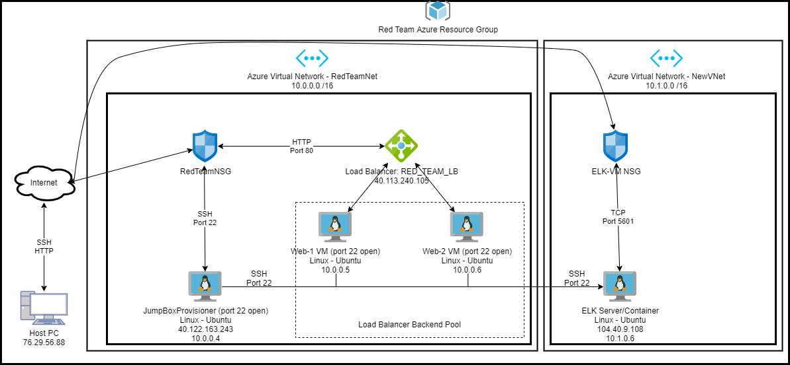
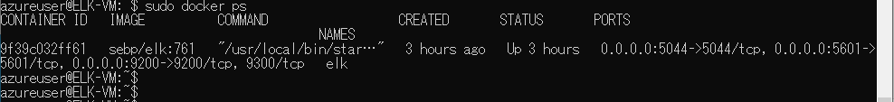

## Automated ELK Stack Deployment

The files in this repository were used to configure the network depicted below.



These files have been tested and used to generate a live ELK deployment on Azure. They can be used to either recreate the entire deployment pictured above. Alternatively, select portions of the YAML file may be used to install only certain pieces of it, such as Filebeat.

[install_elk.yml File](YAMLs/install_elk.yml)

 ```
---
- name: Config Elk VM with Docker
  hosts: elk
  remote_user: azureuser
  become: true
  tasks:
# Use apt module
    - name: install docker.io
      apt:
        update_cache: yes
        force_apt_get: yes
        name: docker.io
        state: present

# Use apt module
    - name: Install python3-pip
      apt:
        force_apt_get: yes
        name: python3-pip
        state: present

# Use pip module
    - name: Install Docker module
      pip:
        name: docker
        state: present

# Use command module
    - name: Increase virtual memory
      command: sysctl -w vm.max_map_count=262144

# Use sysctl module
    - name: Use more memory
      sysctl:
         name: vm.max_map_count
         value: '262144'
         state: present
         reload: yes

# Use docker_container module
    - name: download and launch a docker elk container
      docker_container:
        name: elk
        image: sebp/elk:761
        state: started
        restart_policy: always
        published_ports:
          - 5601:5601
          - 9200:9200
          - 5044:5044

# Use systemd module
    - name: Enable docker service on boot
      systemd:
        name: docker
        enabled: yes
 ```

This document contains the following details:
- Description of the Topology
- Access Policies
- ELK Configuration
  - Beats in Use
  - Machines Being Monitored
- How to Use the Ansible Build


### Description of the Topology

The main purpose of this network is to expose a load-balanced and monitored instance of DVWA, the D*mn Vulnerable Web Application.

Load balancing ensures that the application will have high availability, in addition to restricting inbound traffic to the network.

What aspect of security do load balancers protect? 
- Since load balancers work by distributing client trafic over multiple servers, and the best server is chosen for each user. This offers a higher level of availability.

What is the advantage of a jump box?
- Jump boxes are used as secure entry points, so then the user can gain access to other servers and utilize more adminitrative tasks.

Integrating an ELK server allows users to easily monitor the vulnerable VMs for changes to the jump box and system network.
- What does Filebeat watch for?
Filebeat watches and tags any alteration of files. (If a file is created or deleted, a log will be created)
- What does Metricbeat record?
Metricbeat aggregates metrics on the system's operating system or other applications being utilized on the server.

The configuration details of each machine may be found below.

| Name     | Function   | IP Address | Operating System |
|----------|------------|------------|------------------|
| Jump Box | Gateway    | 10.0.0.4   | Linux            |
| Web-1    | Webserver  | 10.0.0.5   | Linux            |
| Web-2    | Webserver  | 10.0.0.6   | Linux            |
| ELK      | Monitoring | 10.1.0.6   | Linux            |

### Access Policies

The machines on the internal network are not exposed to the public Internet. 

Only the jump box machine can accept connections from the Internet. Access to this machine is only allowed from the following IP addresses:
- IP Address: 76.29.56.88.

Machines within the network can only be accessed by the jump box.

Which machine did you allow to access your ELK VM? What was its IP address?
- My Home machine, with an IP address of 76.29.56.88

A summary of the access policies in place can be found in the table below.

| Name     | Publicly Accessible | Allowed IP Addresses |
|----------|---------------------|----------------------|
| Jump Box | Yes                 | 76.29.56.88          |
| Web-1    | No                  | 10.1.0.6             |
| Web-2    | No                  | 10.1.0.6             |
| ELK      | No                  | 10.1.0.6             |

### Elk Configuration

Ansible was used to automate configuration of the ELK machine. No configuration was performed manually, which is advantageous because... What is the main advantage of automating configuration with Ansible?
- Cost Effective: All ELK and ansible tools are open-source, so they can be utilized by anyone.
- Versatility: Offers a tremendous amount of flexibilty since it can be setup and run on any device.
- Ease of Use: This is a very easy build for people new to networking and cloud services.
- There isn't too high of a knowledge barrier here, since it is so simple to set-up and get running.

The playbook implements the following tasks (In 3-5 bullets, explain the steps of the ELK installation play. E.g., install Docker; download image; etc.):
- Install Docker
- Install Python3-pip
- Increase Virtual Memory through sysctl
- Download and Launch Docker ELK Container
- Enable docker upon boot

The following screenshot displays the result of running `docker ps` after successfully configuring the ELK instance.



### Target Machines & Beats

This ELK server is configured to monitor the following machines:
- Web-1: 10.0.0.5
- Web-2: 10.0.0.6

We have installed the following Beats on these machines:
- Filebeat & Metricbeat

These Beats allow us to collect the following information from each machine:
- Filebeat: Logs and collects any data related to changes in the file system.
- Metricbeat: Logs and aggregates different performance metrics across the configured machines.

### Using the Playbook
In order to use the playbook, you will need to have an Ansible control node already configured. Assuming you have such a control node provisioned: 

SSH into the control node and follow the steps below:
- Copy the elk-install.yml file to /etc/ansible.
- Update the hosts file to include the elk server and dest. ip, so that the playbook can run properly.
- Run the playbook, and navigate to Kibana (http://[you_elk's_IP]:5601/app/kibana) to check that the installation worked as expected.

Answer the following questions:
- Which file is the playbook? Where do you copy it?
  - /etc/ansible/roles/filebeat-playbook.yml
- Which file do you update to make Ansible run the playbook on a specific machine?
  - The hosts file.
- How do I specify which machine to install the ELK server on versus which to install Filebeat on?
  - Webservers will need to have filebeat installed on them, whereas the elk server has an IP of 10.1.0.6
- Which URL do you go to, to check ELK is running?
  - http://76.29.56.88:5601/app/kibana
